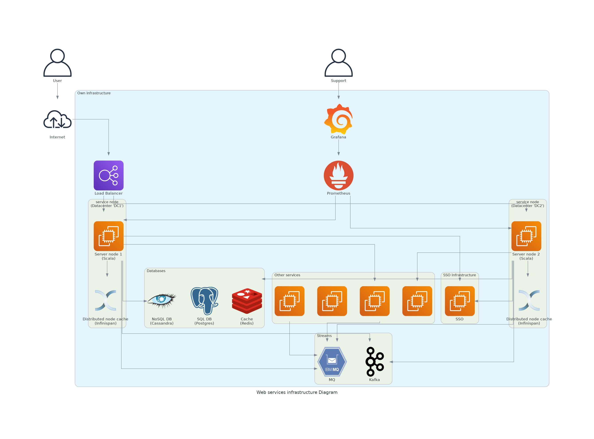

An example of extending diagrams with your nodes
================================================

Custom nodes contains in `resources/other`. Python code contains in `other.py`.

Usage example of own nodes:

```python
from diagrams import Diagram, Cluster
from diagrams.aws.compute import EC2
from diagrams.aws.network import ELB
from diagrams.aws.network import Route53
from diagrams.onprem.client import User
from diagrams.onprem.database import Cassandra, Oracle, PostgreSQL
from diagrams.onprem.inmemory import Redis
from diagrams.onprem.monitoring import Prometheus, Grafana
from diagrams.onprem.network import Internet
from diagrams.onprem.queue import Kafka
from other import Infinispan, Ibmmq

with Diagram("Web services infrastructure Diagram", show=False, direction='TB'):
    user = User("User")
    support = User("Support")
    internet = Internet("Internet")

    with Cluster("Own infrastructure"):
        load_balancer = ELB("Load Balancer")

        with Cluster("service node\n(Datacenter 'DC1')"):
            service1 = EC2("Server node 1\n(Scala)")
            infinispan1 = Infinispan("Distributed node cache\n(Infinispan)")
        with Cluster("service node\n(Datacenter 'DC2')"):
            service2 = EC2("Server node 2\n(Scala)")
            infinispan2 = Infinispan("Distributed node cache\n(Infinispan)")

        service1 >> infinispan1
        service2 >> infinispan2

        prometheus = Prometheus("Prometheus")
        grafana = Grafana("Grafana")

        prometheus >> service1
        prometheus >> service2
        grafana >> prometheus
        support >> grafana

        with Cluster("Streams"):
            kafka = Kafka("Kafka")
            ibmmq = Ibmmq("MQ")

        with Cluster("Databases"):
            cassandra = Cassandra("NoSQL DB\n(Cassandra)")
            database = PostgreSQL("SQL DB\n(Postgres)")
            redis = Redis("Cache\n(Redis)")

        with Cluster("Other services"):
            service3 = EC2("")
            service4 = EC2("")
            service5 = EC2("")
            service6 = EC2("")

        with Cluster("SSO Infrastructure"):
            sso = EC2("SSO")

    user >> internet

    internet >> load_balancer

    load_balancer >> service1
    load_balancer >> service2

    service1 >> kafka
    service2 >> kafka

    service1 >> ibmmq
    service2 >> ibmmq
    service3 >> ibmmq
    service6 >> ibmmq

    service1 >> cassandra
    service2 >> redis

    service1 >> service3
    service2 >> service4

    service1 >> sso
    service2 >> sso

```

Result:
